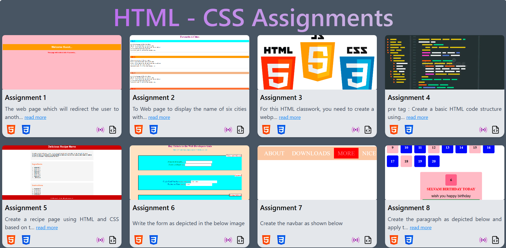

# 📝 HTML & CSS Assignments

This section includes a collection of hands-on assignments built using only HTML and CSS. Each project focuses on strengthening foundational web development skills, including:

🏗️ Semantic HTML structure

📱 Responsive layouts

🎨 Styling with CSS

🔲 Grid and Flexbox designs

🧾 Forms and input elements

🧭 Navigation menus

✍️ Visual presentation and typography

These mini-projects simulate real-world components and layouts, helping build a strong frontend base without using JavaScript or frameworks.

## 🖼️ UI Overview

## 🛠️ Tech Stack

- **HTML**
- **CSS**

## 🚀 Live Demo

## 📄 License

MIT License

Copyright (c) 2025 Tejas

Open source under the 
